# Wedding Invite Website - Free & Open Source Template

A beautiful, fully customizable wedding website template built with React and Tailwind CSS. **100% FREE** - no credit card required! Perfect for couples who want to share their special day with guests through a modern, self-hostable web application.

## ✨ Features

- 🎨 **Beautiful, Modern UI** - Apple-inspired design that looks great on all devices
- 📸 **Photo Upload & Gallery** - Guests can upload photos and view them in the gallery (stored in Google Drive - FREE, automatically displayed)
- 💌 **Blessings & Messages** - Collect heartfelt messages (stored in Google Sheets - FREE)
- 📅 **Event Management & RSVP** - Display multiple events with RSVP functionality
- 📖 **Our Story** - Share your love story with customizable sections
- 👥 **Wedding Party** - Showcase bridesmaids and groomsmen
- 🎁 **Registry** - Link to gift registries and cash funds
- ✈️ **Travel & Accommodation** - Share hotel info and travel details
- ❓ **FAQ** - Answer common questions
- ⏱️ **Timeline** - Show relationship milestones
- 🌍 **Multi-Cultural Support** - Pre-configured for Hindu and Christian weddings
- ⚙️ **Fully Configurable** - Enable/disable features, customize everything
- 🚀 **Free Deployment** - Deploy to Netlify (FREE tier)

## 📸 Screenshots

### Homepage
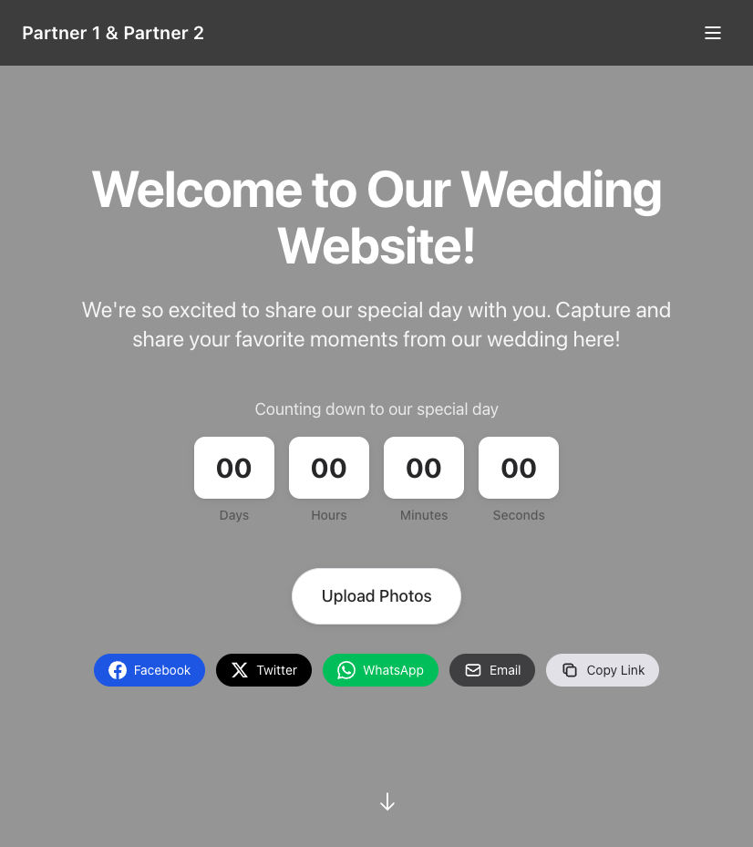

### Our Story
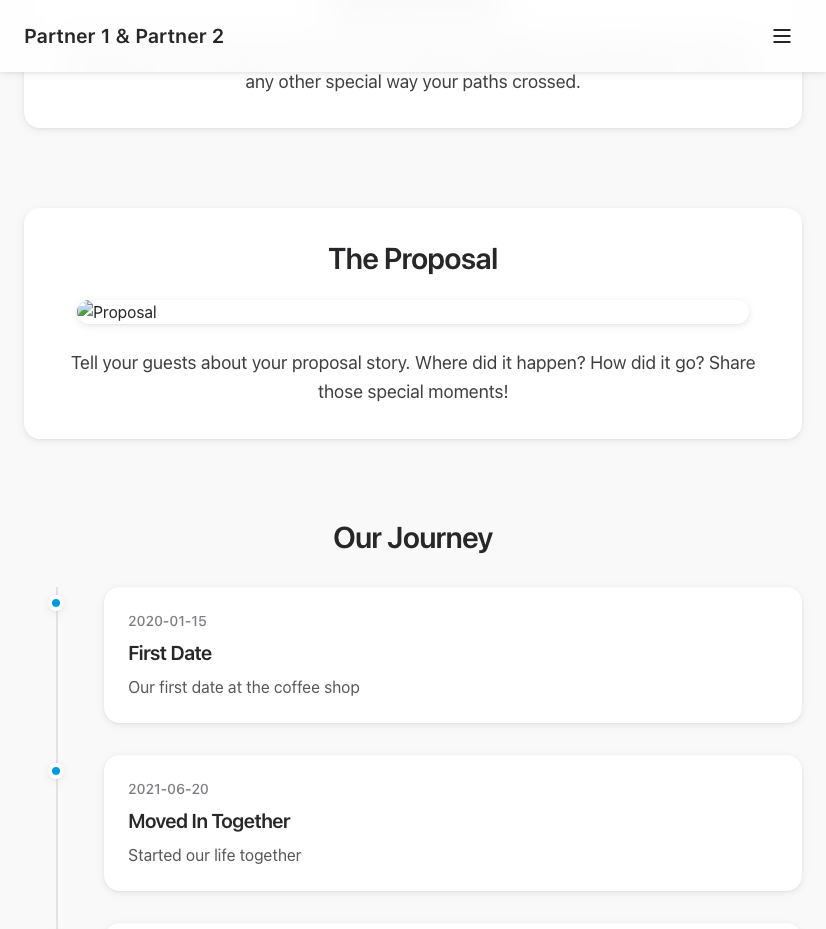

### Events & RSVP
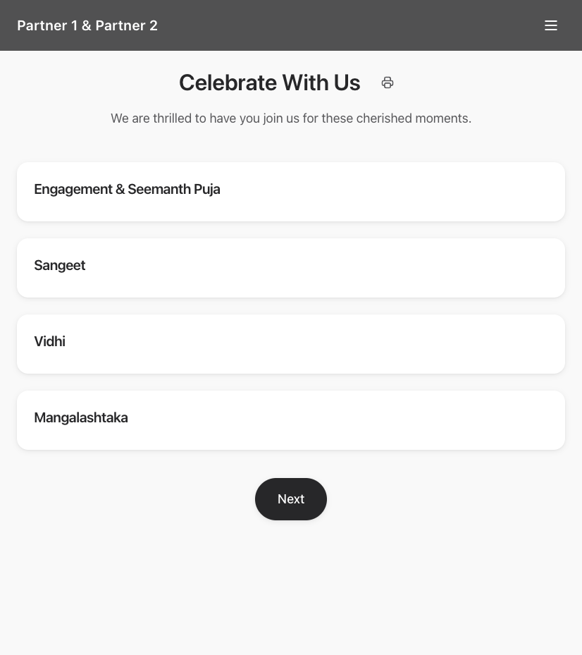

### Photo Gallery
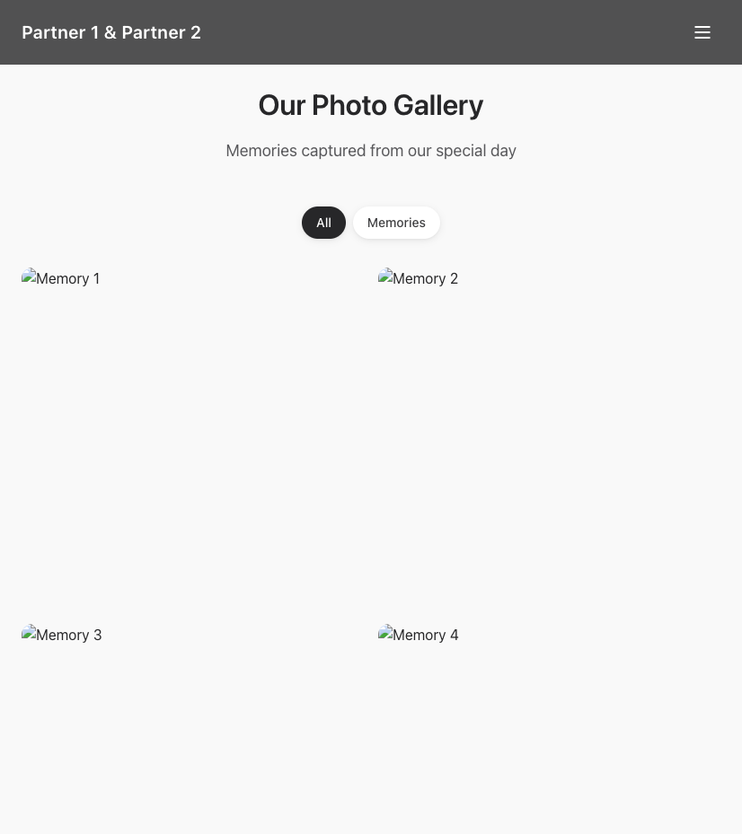

### Upload Photos
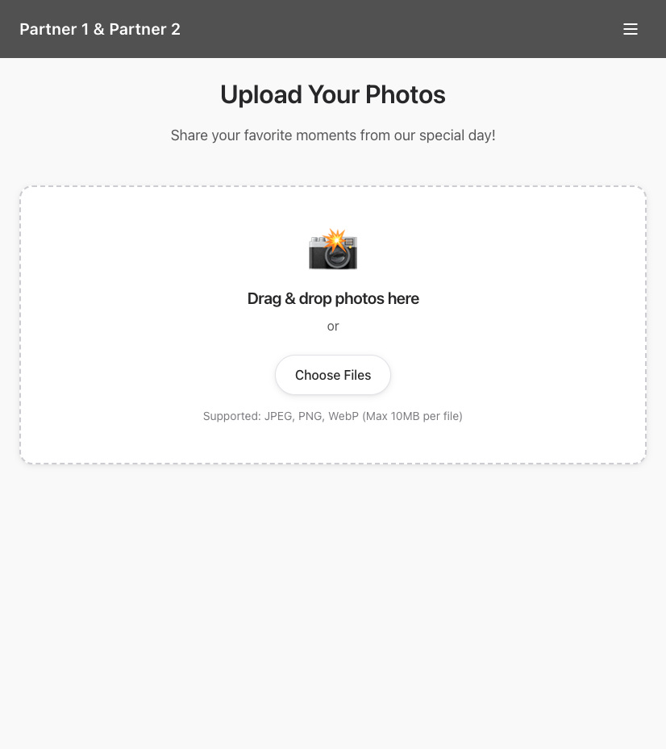

### Blessings
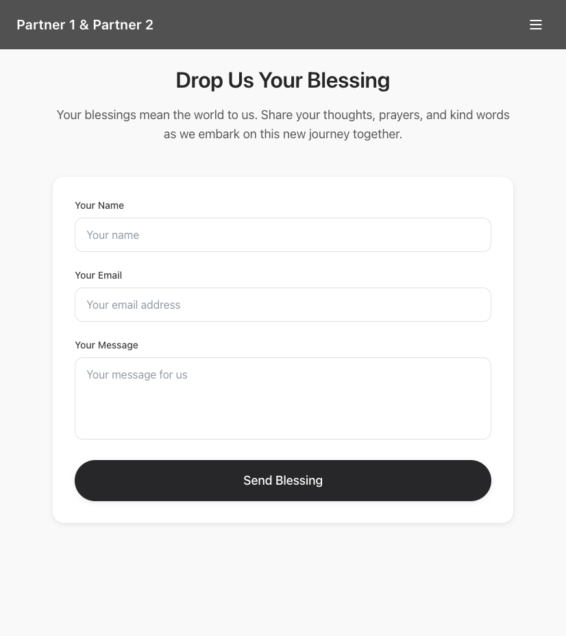

### Wedding Party
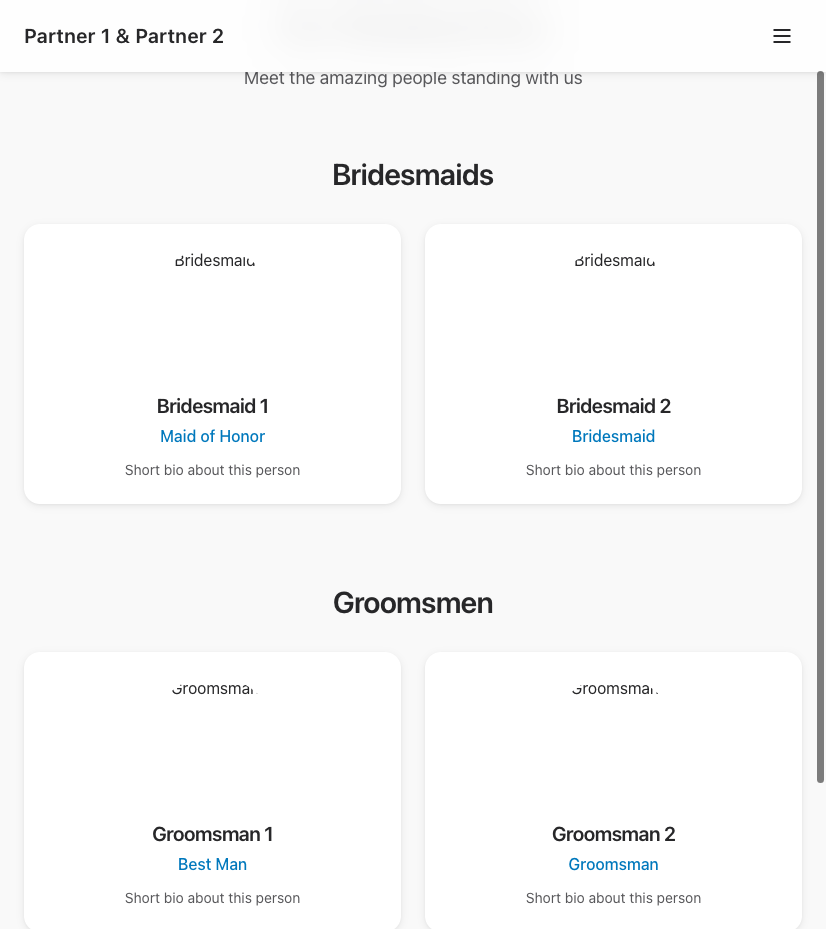

### Registry
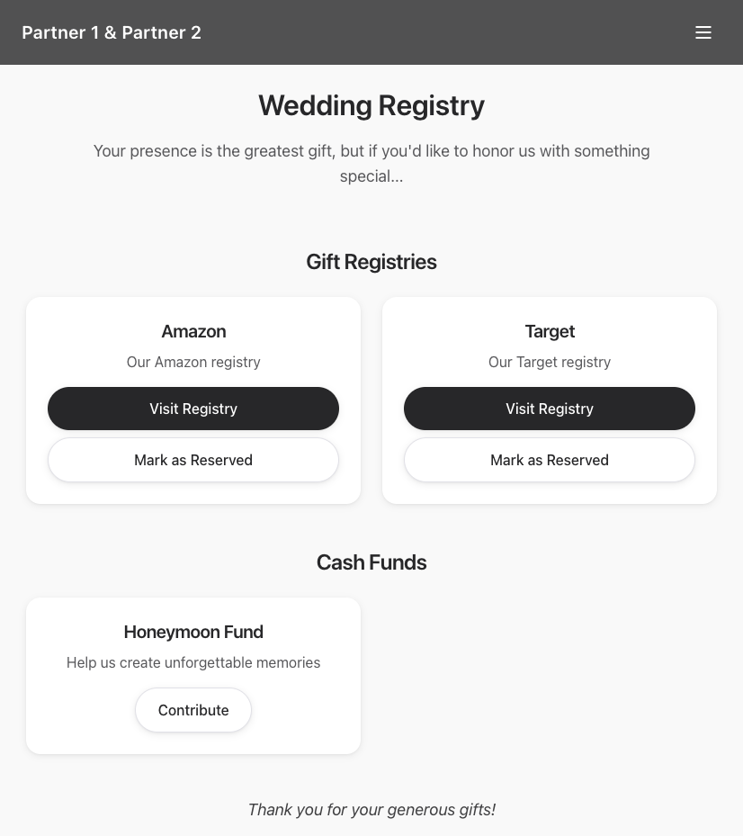

### Travel & Accommodation
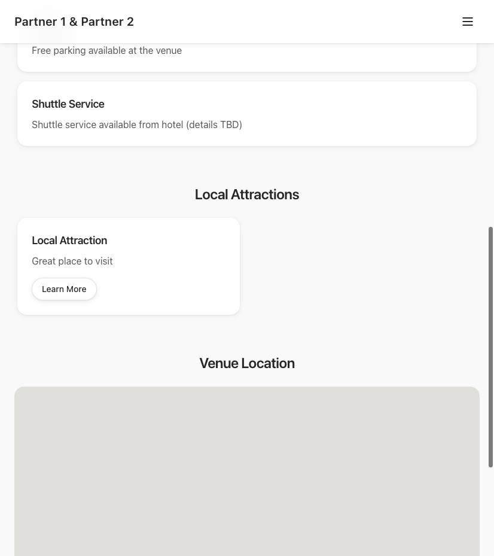

### FAQ
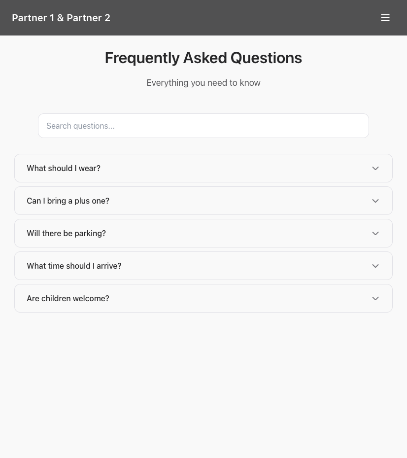

### Timeline
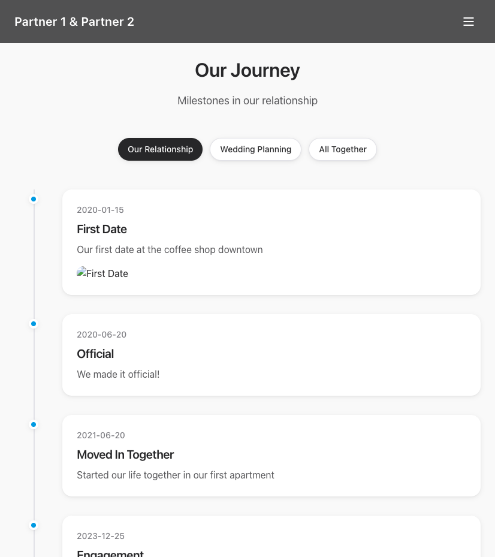

## 🎯 Quick Start

### Prerequisites

- Node.js (v14 or higher) - [Download here](https://nodejs.org/)
- A Google account (FREE) - for Drive and Sheets
- A Netlify account (FREE) - for hosting

**That's it! No credit card needed for any service.**

### Installation

1. **Clone the repository**
   ```bash
   git clone <your-repo-url>
   cd wedding-invite
   ```

2. **Install dependencies**
   ```bash
   npm install
   ```

3. **Configure your site**
   - Edit `src/siteConfig.js` to customize all content
   - Copy `env.example.txt` to `.env` and add your secrets (see setup guide below)

4. **Start the development server**
   ```bash
   npm start
   ```
   The app will open at `http://localhost:3000`

## 📋 Feature Toggle Guide

All features are **enabled by default**. To disable any feature, edit `src/siteConfig.js`:

```javascript
features: {
  homepage: { enabled: true, label: "Home" },
  ourStory: { enabled: true, label: "Our Story" },
  events: { enabled: true, label: "Events & RSVP" },
  photoGallery: { enabled: true, label: "Photo Gallery" },
  uploadPhotos: { enabled: true, label: "Upload Photos" },
  blessings: { enabled: true, label: "Blessings" },
  weddingParty: { enabled: true, label: "Wedding Party" },
  registry: { enabled: true, label: "Registry" },
  travel: { enabled: true, label: "Travel & Accommodation" },
  faq: { enabled: true, label: "FAQ" },
  timeline: { enabled: true, label: "Timeline" },
}
```

**To disable a feature:** Change `enabled: true` to `enabled: false`

## 🎭 Wedding Type Configuration

The template supports multiple wedding traditions. Set your wedding type in `src/siteConfig.js`:

```javascript
weddingType: "hindu", // Options: "hindu", "christian", "custom"
```

### Hindu Wedding
- Pre-configured events: Engagement, Haldi, Mehndi, Sangeet, Baraat, Vidhi, Reception
- Traditional terminology and dress codes
- See `src/examples/hindu-wedding-config.js` for example

### Christian Wedding
- Pre-configured events: Rehearsal Dinner, Ceremony, Cocktail Hour, Reception, After Party
- Church-friendly content
- See `src/examples/christian-wedding-config.js` for example

### Custom Wedding
- Create your own event list
- Fully customizable for any tradition or style

## 🔐 FREE Setup Guide - Step by Step

### Step 1: Google Sheets Setup (FREE)

**Purpose:** Store blessings/messages and RSVP data

1. Go to [Google Sheets](https://sheets.google.com/)
2. Create a new spreadsheet
3. Name it "Wedding Blessings" (or any name you prefer)
4. Add headers in row 1 (optional but recommended):
   - Column A: `Name`
   - Column B: `Email`
   - Column C: `Message`
   - Column D: `Timestamp`
5. Copy the Spreadsheet ID from the URL:
   ```
   https://docs.google.com/spreadsheets/d/SPREADSHEET_ID_HERE/edit
   ```
   The part after `/d/` and before `/edit` is your Spreadsheet ID
6. Save this ID - you'll need it later

**Cost:** FREE (unlimited spreadsheets)

### Step 2: Google Drive Setup (FREE)

**Purpose:** Store uploaded photos

1. Go to [Google Drive](https://drive.google.com/)
2. Create a new folder (name it "Wedding Photos" or similar)
3. Open the folder
4. Copy the Folder ID from the URL:
   ```
   https://drive.google.com/drive/folders/FOLDER_ID_HERE
   ```
   The part after `/folders/` is your Folder ID
5. Save this ID - you'll need it later

**Cost:** FREE (15GB free storage - more than enough for wedding photos)

### Step 3: Google Cloud Setup (FREE - No Billing Required)

**Purpose:** Enable API access for Drive and Sheets

1. Go to [Google Cloud Console](https://console.cloud.google.com/)
2. Sign in with your Google account
3. **Create a new project:**
   - Click the project dropdown at the top
   - Click "New Project"
   - Name it "Wedding Website" (or any name)
   - Click "Create"
   - **Important:** No billing account needed - click "Skip" if asked
4. **Enable APIs:**
   - Go to "APIs & Services" > "Library"
   - Search for "Google Drive API" and click "Enable"
   - Search for "Google Sheets API" and click "Enable"
5. **Create Service Account:**
   - Go to "IAM & Admin" > "Service Accounts"
   - Click "Create Service Account"
   - Name: "wedding-website" (or any name)
   - Click "Create and Continue"
   - Skip role assignment (click "Continue")
   - Click "Done"
6. **Create Key:**
   - Click on your newly created service account
   - Go to "Keys" tab
   - Click "Add Key" > "Create new key"
   - Choose "JSON" format
   - Click "Create"
   - The JSON file will download automatically
7. **Get Service Account Email:**
   - In the service account details, copy the email address (looks like `wedding-website@project-id.iam.gserviceaccount.com`)
   - You'll need this to share folders/sheets

**Cost:** FREE (free tier includes more than enough API calls for a wedding website)

### Step 4: Share Folders/Sheets with Service Account

1. **Share Google Drive Folder:**
   - Open your Google Drive folder
   - Click "Share"
   - Paste your service account email
   - Give it "Editor" permissions
   - Click "Send"

2. **Share Google Sheet:**
   - Open your Google Sheet
   - Click "Share"
   - Paste your service account email
   - Give it "Editor" permissions
   - Click "Send"

### Step 5: Configure Environment Variables

1. Copy `env.example.txt` to `.env`:
   ```bash
   cp env.example.txt .env
   ```

2. Open `.env` and fill in your values:

   **GOOGLE_SERVICE_ACCOUNT_JSON:**
   - Open the JSON file you downloaded from Google Cloud
   - Copy the ENTIRE contents (it's one long line)
   - Paste it in `.env` after the `=` sign
   - Example:
     ```
     GOOGLE_SERVICE_ACCOUNT_JSON={"type":"service_account","project_id":"your-project",...}
     ```

   **GOOGLE_DRIVE_FOLDER_ID:**
   - Paste the folder ID you saved from Step 2
   - Example:
     ```
     GOOGLE_DRIVE_FOLDER_ID=ABC123XYZ789
     ```

   **GOOGLE_SPREADSHEET_ID:**
   - Paste the spreadsheet ID you saved from Step 1
   - Example:
     ```
     GOOGLE_SPREADSHEET_ID=XYZ789ABC123
     ```

   **REACT_APP_RSVP_API_URL:**
   - Leave empty if not using Google Apps Script
   - Or add your Google Apps Script URL if you have one

3. Save the `.env` file

**Important:** Never commit your `.env` file to git! It's already in `.gitignore`.

### Step 6: Test Locally

1. Start the development server:
   ```bash
   npm start
   ```

2. Test the features:
   - Upload a photo (should appear in your Google Drive folder)
   - Check Photo Gallery page - uploaded photos should appear there
   - Submit a blessing (should appear in your Google Sheet)
   - Check RSVP functionality

**Important for Photo Gallery:**
- Uploaded photos will automatically appear in the Photo Gallery
- Make sure your Google Drive folder is shared with "Anyone with the link" (Viewer permission) for photos to display properly
- Or share each uploaded file individually with "Anyone with the link"
- You can disable showing uploaded photos by setting `showUploadedPhotos: false` in `siteConfig.js`

## 🚀 FREE Deployment to Netlify

### Option 1: Deploy via Netlify Dashboard (Easiest)

1. **Push your code to GitHub:**
   - Create a GitHub repository
   - Push your code (make sure `.env` is NOT committed)

2. **Connect to Netlify:**
   - Go to [Netlify](https://www.netlify.com/)
   - Sign up/login (FREE)
   - Click "Add new site" > "Import an existing project"
   - Connect to GitHub
   - Select your repository

3. **Configure Build Settings:**
   - Build command: `npm run build`
   - Publish directory: `build`
   - Click "Deploy site"

4. **Add Environment Variables:**
   - Go to Site Settings > Environment Variables
   - Add each variable from your `.env` file:
     - `GOOGLE_SERVICE_ACCOUNT_JSON` (paste the entire JSON)
     - `GOOGLE_DRIVE_FOLDER_ID`
     - `GOOGLE_SPREADSHEET_ID`
     - `REACT_APP_RSVP_API_URL` (if using)

5. **Redeploy:**
   - Go to Deploys tab
   - Click "Trigger deploy" > "Clear cache and deploy site"

6. **Your site is live!**
   - Netlify will give you a URL like `your-site.netlify.app`
   - You can add a custom domain (FREE) in Site Settings > Domain Management

**Cost:** FREE (Netlify free tier includes 100GB bandwidth/month - more than enough)

### Option 2: Deploy via Netlify CLI

```bash
# Install Netlify CLI
npm install -g netlify-cli

# Login to Netlify
netlify login

# Deploy
netlify deploy --prod
```

## 📝 Configuration Guide

### Site Content (`src/siteConfig.js`)

All customizable content is in `src/siteConfig.js`. Edit this file to personalize:

- **Couple Information:** Names, display name, photos
- **Wedding Date:** For countdown timer
- **Homepage:** Title, subtitle, call-to-action
- **Our Story:** Partner stories, how we met, proposal, milestones
- **Events:** Event details, dates, venues, maps, dress codes
- **Wedding Party:** Bridesmaids and groomsmen
- **Registry:** Gift registries and cash funds
- **Travel:** Hotels, transportation, local attractions
- **FAQ:** Common questions and answers
- **Timeline:** Relationship milestones

### Example Configurations

See `src/examples/` folder for:
- `hindu-wedding-config.js` - Hindu wedding template
- `christian-wedding-config.js` - Christian wedding template
- `minimal-config.js` - Minimal setup template

## 🎨 Customization

### Adding Your Photos

1. Replace placeholder images in `public/images/`:
   - `partner1.svg` → Your photo
   - `partner2.svg` → Your photo
   - `photo1.svg` through `photo4.svg` → Your memory photos
   - `homage_page_background.png` → Your background image

2. Update image paths in `src/siteConfig.js` if using different filenames

### Styling

The project uses Tailwind CSS. Customize styles by:
- Editing component files directly
- Modifying `tailwind.config.js` for theme customization
- Adding custom CSS in `src/index.css`

## 📊 Understanding Your Data

### Google Sheets Structure

Your blessings will be stored with columns:
- **Name:** Guest's name
- **Email:** Guest's email
- **Message:** Their blessing/message
- **Timestamp:** When it was submitted

### Google Drive Structure

Uploaded photos will be stored in your specified folder with:
- Original filename
- Upload timestamp
- Any captions (if enabled)

## 🔧 Troubleshooting

### Google API Errors

- **"Permission denied":** Ensure service account has Editor access to Drive folder and Sheet
- **"Invalid credentials":** Check that `GOOGLE_SERVICE_ACCOUNT_JSON` is valid JSON (one line, no breaks)
- **"Folder not found":** Verify `GOOGLE_DRIVE_FOLDER_ID` is correct (from URL after `/folders/`)
- **"Spreadsheet not found":** Verify `GOOGLE_SPREADSHEET_ID` is correct (from URL after `/d/`)

### Build Errors

- **Module not found:** Run `npm install`
- **Environment variables not loading:** 
  - Ensure `.env` file exists in root directory
  - For Netlify: Add variables in dashboard, not `.env` file
  - Variable names must match exactly (case-sensitive)

### Deployment Issues

- **Netlify functions not working:** Check environment variables are set in Netlify dashboard
- **Photos not uploading:** Verify `GOOGLE_DRIVE_FOLDER_ID` and service account permissions
- **Blessings not saving:** Verify `GOOGLE_SPREADSHEET_ID` and service account permissions

## 💰 Cost Breakdown

**Everything is FREE:**

- ✅ Google Account - FREE
- ✅ Google Drive (15GB) - FREE
- ✅ Google Sheets (unlimited) - FREE
- ✅ Google Cloud APIs (free tier) - FREE
- ✅ Netlify Hosting (100GB bandwidth/month) - FREE
- ✅ Custom Domain (optional) - ~$10-15/year (not required)

**Total Cost: $0** (or ~$10-15/year if you want a custom domain)

## 📚 Additional Resources

- [Google Cloud Console](https://console.cloud.google.com/)
- [Google Drive](https://drive.google.com/)
- [Google Sheets](https://sheets.google.com/)
- [Netlify Documentation](https://docs.netlify.com/)
- [React Documentation](https://react.dev/)
- [Tailwind CSS Documentation](https://tailwindcss.com/)

## 🤝 Contributing

Contributions are welcome! Please see [CONTRIBUTING.md](CONTRIBUTING.md) for guidelines on how to contribute.

## 📄 License

ISC License - feel free to use this template for your wedding website!

## 💬 Support

For issues and questions, please open an issue on GitHub.

---

Made with ❤️ for couples celebrating their special day

**Remember:** This entire setup is FREE. No credit card required. No hidden costs. Just follow the steps above and you'll have a beautiful wedding website in no time!
